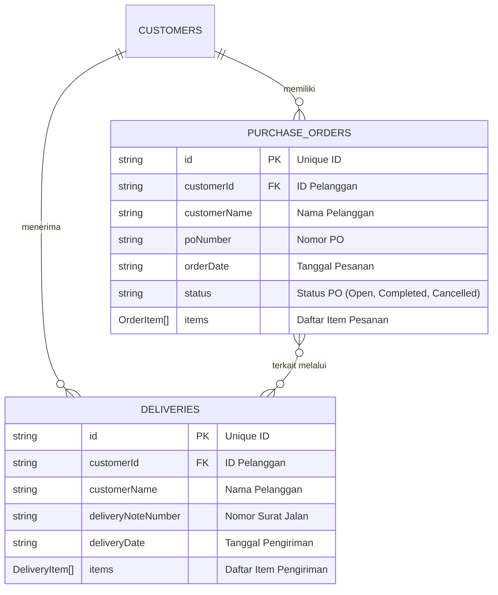
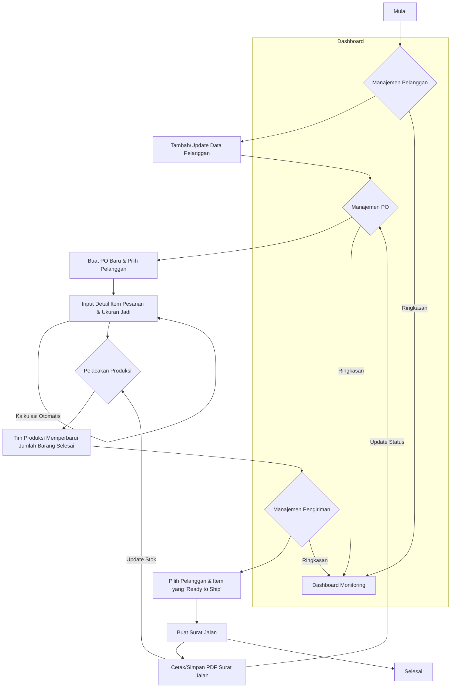

# CartonFlow - Sistem Manajemen Produksi Karton

CartonFlow adalah aplikasi web komprehensif yang dirancang untuk mengelola seluruh alur kerja operasional pada perusahaan manufaktur karton. Aplikasi ini memusatkan data dan menyederhanakan proses mulai dari manajemen pelanggan, pesanan pembelian (PO), pelacakan produksi, hingga pengiriman barang.

## Fitur Utama

Aplikasi ini dibangun dengan serangkaian fitur yang saling terintegrasi untuk memberikan kontrol penuh atas proses bisnis:

-   **Dashboard Analitis**: Halaman utama yang menyajikan ringkasan data penting secara visual. Ini termasuk jumlah total pelanggan, jumlah PO yang masih aktif (belum selesai), total kuantitas barang yang siap kirim dari semua PO aktif, dan jumlah pengiriman yang dilakukan pada bulan berjalan. Dashboard juga menampilkan 5 aktivitas terbaru (baik PO baru maupun surat jalan yang baru dibuat) dan dilengkapi grafik batang untuk memantau tren volume pesanan vs. pengiriman per bulan dalam setahun.

-   **Manajemen Pelanggan (CRM)**: Modul untuk mengelola data pelanggan (Create, Read, Update, Delete). Tampilan daftar pelanggan bersifat responsif; pada layar besar (desktop), data ditampilkan dalam bentuk tabel yang dapat diurutkan dan dicari. Pada layar kecil (mobile), data ditampilkan dalam bentuk kartu (cards) untuk keterbacaan yang lebih baik.

-   **Manajemen Purchase Order (PO)**:
    -   **Pembuatan PO**: Memungkinkan pencatatan PO baru dari pelanggan yang sudah terdaftar. Form input dirancang untuk menangani detail item pesanan yang kompleks.
    -   **Kalkulasi Material Otomatis**: Salah satu fitur inti, di mana sistem secara otomatis menghitung ukuran bahan baku (dalam milimeter) yang dibutuhkan berdasarkan "ukuran jadi" (dalam sentimeter) yang dimasukkan pengguna. Rumus ini disesuaikan berdasarkan tipe item (`Box` atau `Layer`), menghemat waktu dan mengurangi potensi kesalahan manusia.
    -   **Manajemen Status**: Status setiap PO (`Open`, `Completed`, `Cancelled`) dapat dikelola dengan mudah. Status PO akan otomatis menjadi `Completed` jika semua item di dalamnya sudah terkirim sepenuhnya.

-   **Pelacakan Produksi**: Halaman khusus untuk tim produksi memantau semua item dari seluruh PO yang perlu dibuat. Setiap item ditampilkan bersama progress bar visual yang menunjukkan perbandingan antara jumlah yang sudah diproduksi dengan total pesanan. Tim produksi dapat dengan mudah memperbarui jumlah barang yang sudah selesai diproduksi melalui sebuah dialog modal.

-   **Manajemen Pengiriman**: Fasilitas untuk membuat Surat Jalan (Delivery Note) berdasarkan item-item yang stoknya sudah siap kirim (`Ready to Ship`). Saat membuat surat jalan, pengguna memilih pelanggan, dan sistem akan secara otomatis menampilkan daftar item dari semua PO pelanggan tersebut yang memiliki stok siap kirim.

-   **Otomatisasi Stok & Status**: Proses pembuatan surat jalan secara otomatis akan memperbarui sisa stok pada PO yang bersangkutan. Jumlah `delivered` (terkirim) pada item PO akan bertambah, dan jumlah `availableToShip` (siap kirim) akan berkurang. Jika seluruh item dalam sebuah PO sudah terkirim, status PO tersebut akan otomatis diperbarui menjadi `Completed`.

-   **Cetak PDF Surat Jalan**: Surat Jalan yang telah dibuat dapat langsung dicetak atau diunduh dalam format PDF. Dokumen PDF ini memiliki desain profesional, berisi semua detail pengiriman, informasi pelanggan, dan kolom tanda tangan, siap untuk diberikan kepada pengemudi dan pelanggan.

-   **Pengaturan Tampilan**: Pengguna dapat memilih antara tema terang (light mode) dengan dominasi abu-abu yang lembut dan tema gelap (dark mode) dengan warna hitam kebiruan yang modern, sesuai preferensi untuk kenyamanan visual.

## Tumpukan Teknologi (Tech Stack)

CartonFlow dibangun menggunakan teknologi modern yang berfokus pada performa, skalabilitas, dan pengalaman pengembang.

-   **Framework**: **Next.js 15** (dengan App Router) - Memberikan performa tinggi melalui Server Components dan rendering sisi server.
-   **Bahasa**: **TypeScript** - Menjamin keamanan tipe (type-safety) dan membuat kode lebih mudah dikelola.
-   **Styling**: **Tailwind CSS** - Kerangka kerja CSS utility-first untuk membangun desain kustom dengan cepat dan efisien.
-   **Komponen UI**: **shadcn/ui** - Kumpulan komponen antarmuka yang indah, dapat digunakan ulang, dan sangat mudah dikustomisasi.
-   **Database**: **Google Firestore** - Database NoSQL yang fleksibel dan real-time, digunakan sebagai backend untuk menyimpan semua data aplikasi.
-   **Manajemen Form**: **React Hook Form** & **Zod** - Kombinasi kuat untuk mengelola state form dan melakukan validasi skema data.
-   **Visualisasi Data**: **Recharts** - Pustaka grafik untuk menampilkan data analitis di dashboard.
-   **Generasi PDF**: **jsPDF** & **jspdf-autotable** - Digunakan untuk membuat dokumen PDF Surat Jalan secara dinamis di sisi klien.

## Struktur Proyek

Struktur folder proyek diorganisir untuk menjaga keterbacaan dan kemudahan pemeliharaan:

-   `src/app/`: Berisi semua halaman dan rute aplikasi, menggunakan sistem App Router Next.js.
-   `src/components/`: Kumpulan komponen React yang dapat digunakan kembali, diorganisir berdasarkan fitur (misalnya, `dashboard`, `customers`, `ui`).
-   `src/lib/`: Berisi logika bisnis inti, termasuk:
    -   `actions/`: Fungsi Server Actions untuk berinteraksi dengan database Firestore (CRUD).
    -   `firebase.ts`: Konfigurasi dan inisialisasi koneksi Firebase.
    -   `types.ts`: Definisi tipe data TypeScript untuk seluruh aplikasi.
    -   `pdf.ts`: Logika untuk membuat dokumen PDF.
-   `src/hooks/`: Berisi custom hooks React, seperti `use-toast` untuk notifikasi.

## Diagram Aplikasi

### Entity-Relationship Diagram (ERD)

Diagram ini menjelaskan struktur dan hubungan antar data di dalam database Firestore.

*   Seorang `CUSTOMER` dapat memiliki banyak `PURCHASE_ORDERS` dan `DELIVERIES`.
*   Setiap `PURCHASE_ORDER` berisi array `OrderItem`. Di dalam `OrderItem` tersimpan detail lengkap seperti ukuran, jumlah pesanan, jumlah terproduksi, dan jumlah terkirim.
*   Setiap `DELIVERY` berisi array `DeliveryItem`.
*   `DeliveryItem` mengambil referensi dari `OrderItem` di dalam `PurchaseOrder` untuk mengurangi jumlah stok yang tersedia untuk dikirim.

### Flowchart Alur Kerja

Diagram ini menggambarkan alur kerja utama dari pesanan hingga pengiriman.

**Penjelasan Alur Rinci:**
1.  **Manajemen Pelanggan**: Admin dapat menambah atau mengubah data pelanggan. Data ini akan digunakan di seluruh aplikasi.
2.  **Manajemen PO**: Admin membuat Purchase Order baru untuk pelanggan yang sudah terdaftar. Saat memasukkan item, admin hanya perlu mengisi **Ukuran Jadi (cm)**, dan sistem akan **otomatis menghitung Ukuran Bahan (mm)**.
3.  **Pelacakan Produksi**: Tim produksi melihat daftar item dari semua PO yang aktif. Mereka mengupdate jumlah barang yang sudah **diproduksi**.
4.  **Manajemen Pengiriman**: Admin membuat surat jalan. Sistem hanya akan menampilkan item-item dari pelanggan terkait yang stoknya siap kirim (yaitu, `jumlah diproduksi` > `jumlah sudah dikirim`).
5.  **Otomatisasi**: Pembuatan surat jalan secara otomatis mengurangi jumlah barang yang "tersedia untuk dikirim" dari PO yang bersangkutan. Jika semua item dalam PO sudah terkirim, status PO akan diperbarui menjadi `Completed`.
6.  **Dashboard**: Semua aktivitas ini dirangkum dalam dashboard untuk pemantauan secara real-time, memberikan gambaran cepat tentang kesehatan operasional bisnis.

---

Proyek ini siap untuk di-hosting di platform modern seperti Firebase App Hosting atau Vercel.
