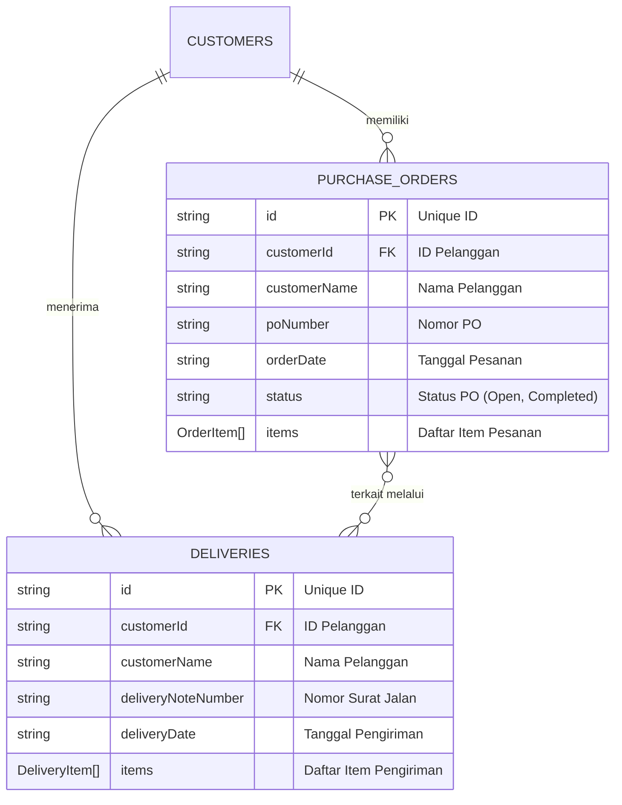
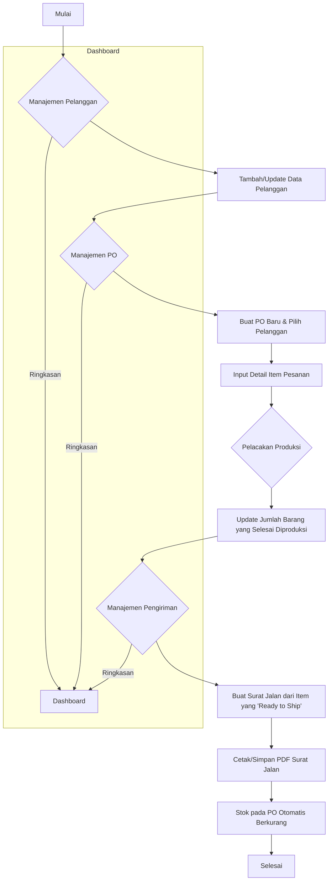

# CartonFlow - Sistem Manajemen Produksi Karton

CartonFlow adalah aplikasi web komprehensif yang dirancang untuk mengelola seluruh alur kerja operasional pada perusahaan manufaktur karton. Aplikasi ini memusatkan data dan menyederhanakan proses mulai dari manajemen pelanggan, pesanan pembelian (PO), pelacakan produksi, hingga pengiriman barang.

## Fitur Utama

Aplikasi ini dibangun dengan serangkaian fitur yang saling terintegrasi untuk memberikan kontrol penuh atas proses bisnis:

-   **Dashboard Analitis**: Halaman utama yang menyajikan ringkasan data penting secara visual, termasuk jumlah pelanggan, PO aktif, barang siap kirim, dan rekap pengiriman bulanan. Dilengkapi juga dengan grafik untuk memantau tren produksi dan pengiriman.

-   **Manajemen Pelanggan (CRM)**: Modul untuk mengelola data pelanggan (Create, Read, Update, Delete). Antarmuka yang responsif memudahkan pengelolaan baik di desktop maupun mobile.

-   **Manajemen Purchase Order (PO)**: Memungkinkan pencatatan PO baru dari pelanggan, lengkap dengan detail item pesanan yang kompleks (ukuran, jenis, jumlah). Status setiap PO (Open, Completed, Cancelled) dapat dikelola dengan mudah.

-   **Pelacakan Produksi**: Halaman khusus untuk tim produksi memantau item apa saja yang perlu dibuat. Progress bar visual memudahkan pelacakan jumlah barang yang sudah diproduksi dibandingkan dengan total pesanan.

-   **Manajemen Pengiriman**: Fasilitas untuk membuat Surat Jalan (Delivery Note) berdasarkan item yang sudah "Ready to Ship". Proses ini secara otomatis akan memperbarui sisa stok pada PO yang bersangkutan.

-   **Cetak PDF Surat Jalan**: Surat Jalan yang dibuat dapat langsung dicetak atau diunduh dalam format PDF dengan desain profesional, siap untuk diberikan kepada pengemudi dan pelanggan.

-   **Pengaturan Tampilan**: Pengguna dapat memilih antara tema terang (light mode) dan gelap (dark mode) sesuai preferensi untuk kenyamanan visual.

-   **Sistem Login Sederhana**: Aplikasi dilindungi oleh sistem otentikasi berbasis kata sandi sederhana untuk menjaga keamanan data.

## Tumpukan Teknologi (Tech Stack)

CartonFlow dibangun menggunakan teknologi modern yang berfokus pada performa, skalabilitas, dan pengalaman pengembang.

-   **Framework**: **Next.js 15** (dengan App Router) - Memberikan performa tinggi melalui Server Components dan rendering sisi server.
-   **Bahasa**: **TypeScript** - Menjamin keamanan tipe (type-safety) dan membuat kode lebih mudah dikelola.
-   **Styling**: **Tailwind CSS** - Kerangka kerja CSS utility-first untuk membangun desain kustom dengan cepat dan efisien.
-   **Komponen UI**: **shadcn/ui** - Kumpulan komponen antarmuka yang indah, dapat digunakan ulang, dan sangat mudah dikustomisasi.
-   **Database**: **Google Firestore** - Database NoSQL yang fleksibel dan real-time, digunakan sebagai backend untuk menyimpan semua data aplikasi.
-   **Manajemen Form**: **React Hook Form** & **Zod** - Kombinasi kuat untuk mengelola state form dan melakukan validasi skema data.
-   **Visualisasi Data**: **Recharts** - Pustaka grafik untuk menampilkan data analitis di dashboard.
-   **Generasi PDF**: **jsPDF** & **jspdf-autotable** - Digunakan untuk membuat dokumen PDF Surat Jalan secara dinamis di sisi klien.

## Struktur Proyek

Struktur folder proyek diorganisir untuk menjaga keterbacaan dan kemudahan pemeliharaan:

-   `src/app/`: Berisi semua halaman dan rute aplikasi, menggunakan sistem App Router Next.js.
-   `src/components/`: Kumpulan komponen React yang dapat digunakan kembali, diorganisir berdasarkan fitur (misalnya, `dashboard`, `customers`, `ui`).
-   `src/lib/`: Berisi logika bisnis inti, termasuk:
    -   `actions/`: Fungsi Server Actions untuk berinteraksi dengan database Firestore (CRUD).
    -   `firebase.ts`: Konfigurasi dan inisialisasi koneksi Firebase.
    -   `types.ts`: Definisi tipe data TypeScript untuk seluruh aplikasi.
    -   `pdf.ts`: Logika untuk membuat dokumen PDF.
-   `src/hooks/`: Berisi custom hooks React, seperti `use-toast` untuk notifikasi.

## Diagram Aplikasi

### Entity-Relationship Diagram (ERD)

Diagram ini menjelaskan struktur dan hubungan antar data di dalam database Firestore.

*   Seorang `CUSTOMER` dapat memiliki banyak `PURCHASE_ORDERS` dan `DELIVERIES`.
*   Setiap `PURCHASE_ORDER` berisi array `OrderItem`.
*   Setiap `DELIVERY` berisi array `DeliveryItem`.
*   `DeliveryItem` mengambil referensi dari `OrderItem` di dalam `PurchaseOrder` untuk mengurangi jumlah stok yang tersedia.

### Flowchart Alur Kerja

Diagram ini menggambarkan alur kerja utama dari pesanan hingga pengiriman.

**Penjelasan Alur:**
1.  **Manajemen Pelanggan**: Admin dapat menambah atau mengubah data pelanggan.
2.  **Manajemen PO**: Admin membuat Purchase Order baru untuk pelanggan yang sudah terdaftar, lalu memasukkan detail setiap item yang dipesan.
3.  **Pelacakan Produksi**: Tim produksi melihat daftar item yang harus dibuat dan memperbarui jumlah yang sudah selesai diproduksi.
4.  **Manajemen Pengiriman**: Admin membuat surat jalan dengan memilih item-item yang stoknya sudah siap kirim.
5.  **Otomatisasi**: Pembuatan surat jalan secara otomatis mengurangi jumlah barang yang "tersedia untuk dikirim" dari PO yang bersangkutan. Jika semua item dalam sebuah PO sudah terkirim, status PO akan diperbarui.
6.  **Dashboard**: Semua aktivitas ini dirangkum dalam dashboard untuk pemantauan secara real-time.

---

Proyek ini siap untuk di-hosting di platform modern seperti Firebase App Hosting atau Vercel.
